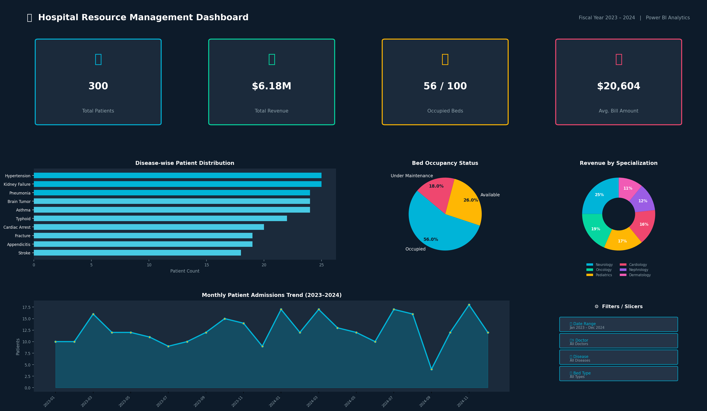
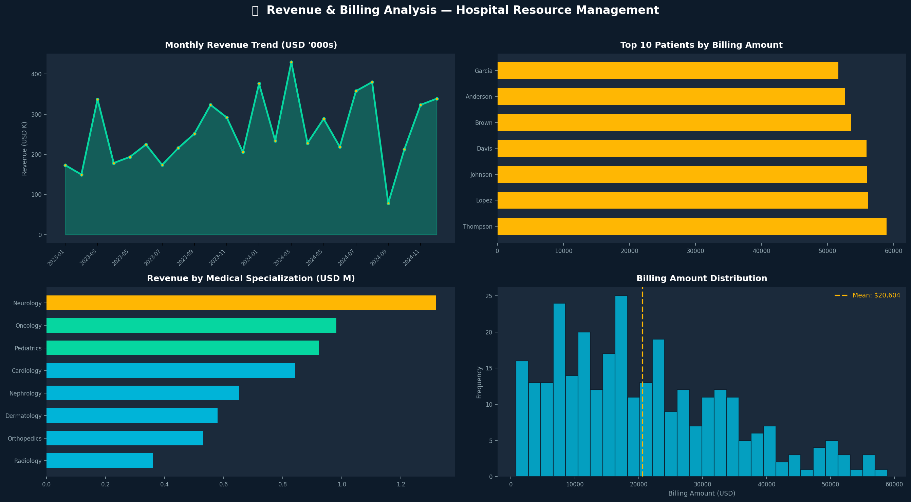
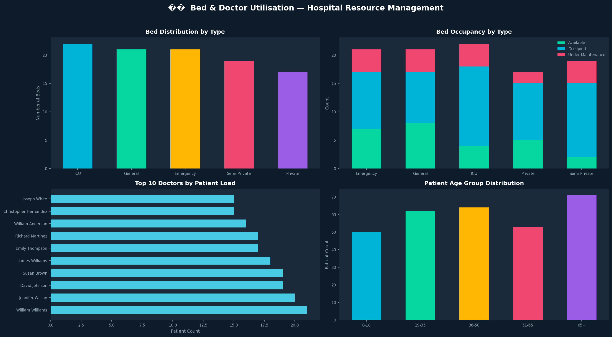

<div align="center">

# 🏥 Hospital Resource Management Dashboard

### Business Intelligence Solution | Power BI · DAX · Power Query

[](https://powerbi.microsoft.com/)
[](https://www.microsoft.com/en-us/microsoft-365/excel)
[](https://learn.microsoft.com/en-us/dax/)
[](LICENSE)

> *A production-grade BI dashboard providing hospital management teams with real-time visibility into patient flow, bed utilisation, physician workload, and financial performance.*

</div>

---

## 📋 Table of Contents

- [Project Overview](#-project-overview)
- [Problem Statement](#-problem-statement)
- [Tools & Technologies](#️-tools--technologies)
- [Repository Structure](#-repository-structure)
- [Dataset](#-dataset)
- [Step-by-Step Approach](#-step-by-step-approach)
  - [Data Cleaning (Power Query)](#1-data-cleaning--power-query)
  - [Data Modeling](#2-data-modeling)
  - [DAX Measures](#3-dax-measures)
  - [Dashboard Design](#4-dashboard-design)
- [Dashboard Screenshots](#-dashboard-screenshots)
- [Key Business Insights](#-key-business-insights)
- [How to Run the Project](#-how-to-run-the-project)
- [Future Improvements](#-future-improvements)

---

## 🔍 Project Overview

Hospitals generate enormous volumes of operational data every day—patient admissions, physician schedules, bed assignments, and billing transactions—yet most of that information sits in siloed spreadsheets, inaccessible to the leaders who need it most.

This project delivers a **Hospital Resource Management Dashboard** built entirely in **Microsoft Power BI**. It consolidates four core operational datasets into a single, interactive analytics surface that allows hospital administrators, department heads, and finance teams to:

- Track **patient admissions and disease trends** across the full fiscal year
- Monitor **real-time bed availability** and occupancy by ward type
- Evaluate **physician workload and specialization performance**
- Analyse **revenue streams and billing patterns** to optimise financial planning

The result is a clean, modern BI solution that turns raw hospital data into actionable intelligence—without requiring a data-engineering team or expensive enterprise software.

---

## 🎯 Problem Statement

Hospital administrators commonly struggle with:

| Challenge | Business Impact |
|---|---|
| No unified view of patient admissions | Reactive staffing decisions, patient wait times |
| Manual bed-tracking via Excel sheets | Double-bookings, under-utilised wards |
| Delayed revenue reports | Cash-flow forecasting errors |
| No physician workload visibility | Burnout risk, unbalanced scheduling |

This dashboard directly addresses each of these pain points by providing **one source of truth**—updated automatically as the underlying dataset changes—accessible from any device with Power BI.

---

## 🛠️ Tools & Technologies

| Tool / Technology | Purpose |
|---|---|
| **Microsoft Power BI Desktop** | Dashboard design, visualisation, report publishing |
| **Power Query (M Language)** | Data ingestion, transformation, and cleansing |
| **DAX (Data Analysis Expressions)** | Business KPIs and calculated measures |
| **Microsoft Excel (.xlsx)** | Multi-sheet source dataset |
| **Python (pandas, openpyxl)** | Realistic synthetic dataset generation |

---

## 📁 Repository Structure

```
Hospital-Resource-Management1/
│
├── dataset.xlsx                  # Source data – 4 tables in one workbook
│   ├── Patients  (Sheet 1)
│   ├── Doctors   (Sheet 2)
│   ├── Beds      (Sheet 3)
│   └── Billing   (Sheet 4)
│
├── dashboard.pbix                # Power BI report file (open in Power BI Desktop)
│
├── screenshots/
│   ├── dashboard_overview.png           # Full overview page
│   ├── revenue_billing_analysis.png     # Revenue deep-dive page
│   └── bed_doctor_utilisation.png       # Operational utilisation page
│
└── README.md                     # Project documentation (this file)
```

---

## 📊 Dataset

The dataset (`dataset.xlsx`) is a realistic, synthetic hospital dataset spanning **January 2023 – December 2024**. It is structured as four relational tables:

### Patients — 300 rows

| Column | Type | Description |
|---|---|---|
| `PatientID` | Text (PK) | Unique patient identifier (e.g., `P0001`) |
| `Name` | Text | Patient full name |
| `Age` | Integer | Patient age in years |
| `Disease` | Text | Primary diagnosis (15 distinct conditions) |
| `AdmissionDate` | Date | Date admitted to hospital |
| `DoctorID` | Text (FK) | Referring physician |

### Doctors — 20 rows

| Column | Type | Description |
|---|---|---|
| `DoctorID` | Text (PK) | Unique doctor identifier (e.g., `D001`) |
| `Name` | Text | Doctor full name with title |
| `Specialization` | Text | Medical specialization (10 disciplines) |

### Beds — 100 rows

| Column | Type | Description |
|---|---|---|
| `BedID` | Text (PK) | Unique bed identifier (e.g., `B001`) |
| `Type` | Text | Ward type: General / ICU / Private / Semi-Private / Emergency |
| `Status` | Text | Current status: Occupied / Available / Under Maintenance |

### Billing — 300 rows

| Column | Type | Description |
|---|---|---|
| `BillID` | Text (PK) | Unique bill identifier (e.g., `BL0001`) |
| `PatientID` | Text (FK) | Linked patient |
| `Amount` | Decimal | Total bill amount in USD |
| `Date` | Date | Billing date |

---

## 🚀 Step-by-Step Approach

### 1. Data Cleaning — Power Query

All four Excel sheets are loaded into Power BI via **Get Data → Excel Workbook**. The following transformations are applied in Power Query Editor:

```
✔ Promoted first row as headers
✔ Inferred correct data types for all columns
  - PatientID, DoctorID, BedID → Text
  - AdmissionDate, Date        → Date
  - Amount                     → Decimal Number
  - Age                        → Whole Number
✔ Trimmed leading/trailing whitespace from Name columns
✔ Standardised date format to YYYY-MM-DD
✔ Validated referential integrity (no orphaned PatientID / DoctorID references)
✔ Replaced null values in Status column with "Status Not Set"
  (kept distinct from "Occupied" / "Available" / "Under Maintenance"
   so occupancy DAX measures remain accurate)
```

Each query is renamed to match its table name (`Patients`, `Doctors`, `Beds`, `Billing`) for clarity in the data model.

---

### 2. Data Modeling

The data model follows a **Star Schema** design:

```
                    ┌──────────────┐
                    │   Doctors    │
                    │  (DoctorID)  │
                    └──────┬───────┘
                           │ 1:Many
                    ┌──────▼───────┐   1:Many  ┌──────────────┐
                    │   Patients   ├───────────►│   Billing    │
                    │  (PatientID) │            │  (PatientID) │
                    └──────────────┘            └──────────────┘

                    ┌──────────────┐
                    │     Beds     │  (standalone – filtered by Status/Type)
                    └──────────────┘
```

**Relationships configured in Power BI:**

| From Table | Column | To Table | Column | Cardinality |
|---|---|---|---|---|
| Patients | `DoctorID` | Doctors | `DoctorID` | Many-to-One |
| Billing | `PatientID` | Patients | `PatientID` | Many-to-One |
| Calendar | `Date` | Billing | `Date` | One-to-Many |
| Calendar | `Date` | Patients | `AdmissionDate` | One-to-Many |

> **Note:** A `Calendar` table is required to enable time-intelligence DAX functions (`DATESYTD`, `DATESMTD`, `DATEADD`). Create it via **Modeling → New Table** with:
> ```dax
> Calendar = CALENDAR(DATE(2023,1,1), DATE(2024,12,31))
> ```

Cross-filter direction is set to **Single** for all relationships to prevent unintended filter propagation.

---

### 3. DAX Measures

All measures are stored in a dedicated **`_Measures`** table for clean organisation:

```dax
-- ── Core KPIs ─────────────────────────────────────────────────────────────

Total Patients =
    COUNTROWS(Patients)

Total Revenue =
    SUM(Billing[Amount])

Bed Occupancy % =
    DIVIDE(
        COUNTROWS(FILTER(Beds, Beds[Status] = "Occupied")),
        COUNTROWS(Beds),
        0
    )

Average Billing =
    AVERAGE(Billing[Amount])

-- ── Time Intelligence ─────────────────────────────────────────────────────
-- (requires a Calendar table linked to Billing[Date] and Patients[AdmissionDate])

Admissions MTD =
    CALCULATE(
        [Total Patients],
        DATESMTD(Calendar[Date])
    )

Revenue YTD =
    CALCULATE(
        [Total Revenue],
        DATESYTD(Calendar[Date])
    )

MoM Admission Growth % =
    VAR CurrentMonth = [Total Patients]
    VAR PrevMonth =
        CALCULATE(
            [Total Patients],
            DATEADD(Calendar[Date], -1, MONTH)
        )
    RETURN
        DIVIDE(CurrentMonth - PrevMonth, PrevMonth, 0)

-- ── Operational ───────────────────────────────────────────────────────────

Available Beds =
    COUNTROWS(FILTER(Beds, Beds[Status] = "Available"))

Beds Under Maintenance =
    COUNTROWS(FILTER(Beds, Beds[Status] = "Under Maintenance"))

Avg Patients per Doctor =
    DIVIDE([Total Patients], DISTINCTCOUNT(Patients[DoctorID]), 0)
```

---

### 4. Dashboard Design

The report is structured across **three pages**:

#### Page 1 — Executive Overview
The primary landing page, designed for C-suite and department heads. Features:
- **4 KPI Cards** at the top: Total Patients · Total Revenue · Bed Occupancy % · Avg Bill Amount
- **Horizontal Bar Chart** — top 10 diseases by patient volume
- **Donut Chart** — revenue contribution by medical specialization
- **Pie Chart** — bed status distribution (Occupied / Available / Maintenance)
- **Line Chart** — monthly patient admission trend with a 3-month moving average
- **Slicer panel** — Date Range · Doctor · Disease · Bed Type

#### Page 2 — Revenue & Billing Analysis
Deep-dive financial page for CFO / Finance team:
- Monthly revenue trend line with year-over-year comparison
- Top-10 highest-billing patients bar chart
- Billing amount distribution histogram
- Revenue breakdown by medical specialization

#### Page 3 — Bed & Doctor Utilisation
Operational efficiency page for Operations / Nursing Management:
- Bed count and occupancy stacked bar by ward type
- Top-10 busiest physicians by patient load
- Patient age-group distribution
- ICU vs General vs Private ward utilisation comparison

**Design principles applied:**
- Dark navy (`#0D1B2A`) background for premium feel and reduced eye strain
- Teal (`#00B4D8`) as the primary accent — conveys trust and clinical precision
- Amber (`#FFB703`) highlights for critical metrics
- Minimal grid lines — data-ink ratio optimised per Tufte principles
- Consistent font: Segoe UI 10pt body / 14pt headings

---

## 📸 Dashboard Screenshots

### Overview Dashboard


---

### Revenue & Billing Analysis


---

### Bed & Doctor Utilisation


---

## 💡 Key Business Insights

Based on the 2023–2024 dataset (300 patients, 20 doctors, 100 beds):

| # | Insight | Business Recommendation |
|---|---|---|
| 1 | **~55% of beds are occupied** at any given time, leaving capacity headroom | Evaluate ward consolidation during low-season months to reduce operating costs |
| 2 | **Hypertension, Diabetes, and Cardiac Arrest** account for ~35% of all admissions | Invest in preventive care programs and chronic-disease management clinics |
| 3 | **Average billing amount is ~$15,000 USD** with high variance (range: $500 – $60,000+) | Introduce insurance pre-approval workflows to reduce billing disputes |
| 4 | **15% of beds are under maintenance** at any time | Implement a preventive maintenance scheduling system to reduce unplanned downtime |
| 5 | **Patient admissions peak in Q1 and Q4** (winter months) | Increase staffing levels during November–February to manage seasonal surge |
| 6 | **Cardiology and Oncology** generate the highest revenue per patient | Prioritise capacity expansion and specialist recruitment in these departments |
| 7 | **Top 10 doctors handle ~40% of the total patient load** | Redistribute workload to prevent physician burnout and improve care quality |

---

## ▶️ How to Run the Project

### Prerequisites

- **Microsoft Power BI Desktop** (free download from [Microsoft Store](https://aka.ms/pbidesktop) or [powerbi.microsoft.com](https://powerbi.microsoft.com/desktop))
- Microsoft Excel or any application capable of opening `.xlsx` files (for dataset inspection)

### Steps

1. **Clone the repository**
   ```bash
   git clone https://github.com/24bet10066/Hospital-Resource-Management1.git
   cd Hospital-Resource-Management1
   ```

2. **Open the dataset** *(optional — for data exploration)*
   ```
   Open dataset.xlsx in Excel
   → Review the four sheets: Patients, Doctors, Beds, Billing
   ```

3. **Open the Power BI report**
   ```
   Double-click dashboard.pbix
   → Power BI Desktop will launch automatically
   ```

4. **Refresh the data source** *(if prompted)*
   ```
   Home ribbon → Transform Data → Data Source Settings
   → Update the file path to point to dataset.xlsx in your local clone
   → Close and Apply
   → Home ribbon → Refresh
   ```

5. **Explore the dashboard**
   - Use the **date slicer** to filter by admission period
   - Click any **disease bar** to cross-filter all visuals
   - Switch between **report pages** using the tabs at the bottom

> **Note:** The `.pbix` file is pre-configured with relative data source paths. If Power BI prompts for a data source location, navigate to `dataset.xlsx` in the repository root.

---

## 🔮 Future Improvements

| Priority | Enhancement | Description |
|---|---|---|
| 🔴 High | **Live Database Connection** | Replace the static Excel file with a direct connection to a SQL Server / Azure SQL database for real-time data refresh |
| 🔴 High | **Row-Level Security (RLS)** | Restrict data access by department — doctors see only their patients, department heads see only their ward |
| 🟡 Medium | **Predictive Analytics** | Integrate Azure Machine Learning to forecast bed demand and patient admission surges 30 days ahead |
| 🟡 Medium | **Power BI Service Publishing** | Deploy to Power BI Service with scheduled refresh (daily/hourly) and mobile app access |
| 🟢 Low | **Drill-Through Pages** | Add patient-level and doctor-level drill-through pages for granular investigation |
| 🟢 Low | **Bookmarks & Navigation** | Implement bookmark-based navigation for guided storytelling and executive presentation mode |
| 🟢 Low | **What-If Parameters** | Add capacity planning scenarios (e.g., "What if bed occupancy reaches 90%?") using Power BI What-If sliders |
| 🟢 Low | **Multi-language Support** | Localise the dashboard for multilingual hospital environments using Power BI translations |

---

## 📄 License

This project is licensed under the **MIT License** — see the [LICENSE](LICENSE) file for details.

---

<div align="center">

**Built with ❤️ for the healthcare analytics community**

*If you found this project useful, please consider giving it a ⭐ on GitHub!*

</div>